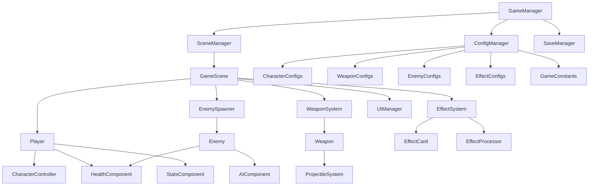

# 设计文档

## 概述

本设计文档描述了使用Godot 4.x引擎开发的吸血鬼幸存者风格肉鸽游戏的技术架构。游戏采用模块化设计，通过资源系统和配置文件实现高度可扩展性，支持热重载和数据驱动的内容创建。

核心设计原则：
- **数据驱动**：所有游戏内容通过配置文件定义
- **模块化**：各系统独立，便于维护和扩展
- **可扩展性**：新内容添加无需修改核心代码
- **性能优化**：适合大量实体的实时游戏

## 架构

### 整体架构图



### 核心系统层次

1. **管理层 (Managers)**
   - GameManager: 游戏状态管理
   - ConfigManager: 配置文件管理
   - SaveManager: 存档系统

2. **游戏逻辑层 (Game Logic)**
   - Player: 玩家角色控制
   - EnemySpawner: 敌人生成系统
   - WeaponSystem: 武器管理
   - EffectSystem: 效果卡片系统

3. **组件层 (Components)**
   - HealthComponent: 生命值管理
   - StatsComponent: 属性管理
   - AIComponent: AI行为

4. **数据层 (Data)**
   - 各种配置文件和资源

## 组件和接口

### 1. 配置管理系统

#### ConfigManager (Singleton)
```gdscript
class_name ConfigManager
extends Node

# 配置文件路径
const CONFIG_PATH = "res://data/configs/"
const CONSTANTS_PATH = "res://data/constants.json"

# 配置缓存
var character_configs: Dictionary = {}
var weapon_configs: Dictionary = {}
var enemy_configs: Dictionary = {}
var effect_configs: Dictionary = {}
var game_constants: Dictionary = {}

func load_all_configs()
func get_character_config(id: String) -> CharacterConfig
func get_weapon_config(id: String) -> WeaponConfig
func get_enemy_config(id: String) -> EnemyConfig
func get_effect_config(id: String) -> EffectConfig
func reload_configs() # 热重载支持
```

#### 配置文件结构
```json
// characters/basic_character.json
{
  "id": "basic_character",
  "name": "基础角色",
  "description": "平衡的新手角色",
  "base_stats": {
    "max_health": 100,
    "move_speed": 150,
    "pickup_range": 50
  },
  "starting_weapon": "basic_gun",
  "sprite_path": "res://sprites/characters/basic.png",
  "special_ability": null
}

// weapons/basic_gun.json
{
  "id": "basic_gun",
  "name": "基础枪械",
  "type": "projectile",
  "base_stats": {
    "damage": 10,
    "fire_rate": 1.0,
    "range": 200,
    "projectile_speed": 300
  },
  "evolution": {
    "required_level": 8,
    "evolved_weapon": "advanced_gun"
  },
  "projectile_scene": "res://weapons/projectiles/BasicBullet.tscn"
}
```

### 2. 角色系统

#### Player (Node2D)
```gdscript
class_name Player
extends CharacterBody2D

@onready var health_component: HealthComponent = $HealthComponent
@onready var stats_component: StatsComponent = $StatsComponent
@onready var weapon_system: WeaponSystem = $WeaponSystem

var character_config: CharacterConfig
var current_level: int = 1
var current_exp: int = 0

func initialize(config: CharacterConfig)
func handle_input()
func move(delta: float)
func level_up()
```

#### StatsComponent (Node)
```gdscript
class_name StatsComponent
extends Node

signal stat_changed(stat_name: String, old_value: float, new_value: float)

var base_stats: Dictionary = {}
var modifiers: Dictionary = {} # 来自效果卡片的修改器

func get_stat(stat_name: String) -> float
func add_modifier(stat_name: String, value: float, type: String)
func remove_modifier(modifier_id: String)
func calculate_final_stat(stat_name: String) -> float
```

### 3. 武器系统

#### WeaponSystem (Node2D)
```gdscript
class_name WeaponSystem
extends Node2D

var active_weapons: Array[Weapon] = []
var weapon_slots: int = 6

func add_weapon(weapon_config: WeaponConfig) -> Weapon
func upgrade_weapon(weapon_id: String)
func evolve_weapon(weapon_id: String)
func get_available_upgrades() -> Array[WeaponConfig]
```

#### Weapon (Node2D)
```gdscript
class_name Weapon
extends Node2D

var config: WeaponConfig
var current_level: int = 1
var fire_timer: Timer

func initialize(weapon_config: WeaponConfig)
func fire(target_position: Vector2)
func upgrade()
func can_evolve() -> bool
```

### 4. 敌人系统

#### EnemySpawner (Node2D)
```gdscript
class_name EnemySpawner
extends Node2D

var spawn_timer: Timer
var difficulty_curve: Curve
var active_enemies: Array[Enemy] = []

func spawn_wave()
func get_spawn_config() -> EnemyConfig
func cleanup_dead_enemies()
```

#### Enemy (CharacterBody2D)
```gdscript
class_name Enemy
extends CharacterBody2D

@onready var ai_component: AIComponent = $AIComponent
@onready var health_component: HealthComponent = $HealthComponent

var config: EnemyConfig
var target: Node2D

func initialize(enemy_config: EnemyConfig)
func take_damage(amount: float)
func die()
```

### 5. 效果卡片系统

#### EffectSystem (Node)
```gdscript
class_name EffectSystem
extends Node

var active_effects: Dictionary = {}
var effect_processor: EffectProcessor

func get_random_effects(count: int) -> Array[EffectConfig]
func apply_effect(effect_config: EffectConfig)
func stack_effect(effect_id: String)
func check_evolution_conditions() -> Array[EffectConfig]
```

#### EffectCard (Resource)
```gdscript
class_name EffectCard
extends Resource

@export var id: String
@export var name: String
@export var description: String
@export var icon: Texture2D
@export var rarity: String # common, rare, epic, legendary
@export var max_stacks: int = 1
@export var effect_type: String # stat_modifier, weapon_modifier, special
@export var effect_data: Dictionary
@export var prerequisites: Array[String] = []
@export var exclusions: Array[String] = []
```

## 数据模型

### 配置文件数据结构

#### CharacterConfig
```gdscript
class_name CharacterConfig
extends Resource

@export var id: String
@export var name: String
@export var description: String
@export var base_stats: Dictionary
@export var starting_weapon: String
@export var sprite_path: String
@export var special_ability: String
```

#### WeaponConfig
```gdscript
class_name WeaponConfig
extends Resource

@export var id: String
@export var name: String
@export var weapon_type: String
@export var base_stats: Dictionary
@export var evolution: Dictionary
@export var projectile_scene: PackedScene
@export var upgrade_tree: Array[Dictionary]
```

### 存档数据结构
```json
{
  "player_progress": {
    "total_games": 150,
    "best_time": 1800,
    "total_kills": 50000,
    "unlocked_characters": ["basic", "warrior", "mage"],
    "permanent_upgrades": {
      "health_boost": 5,
      "damage_boost": 3,
      "speed_boost": 2
    }
  },
  "settings": {
    "master_volume": 0.8,
    "sfx_volume": 0.9,
    "music_volume": 0.7
  }
}
```

## 错误处理

### 配置文件错误处理
1. **文件缺失**：使用默认配置并记录警告
2. **格式错误**：跳过错误项，使用默认值
3. **引用错误**：检查依赖关系，提供友好错误信息
4. **热重载失败**：回滚到上一个有效配置

### 运行时错误处理
1. **内存不足**：清理不必要的敌人和效果
2. **性能下降**：动态调整敌人数量和效果质量
3. **存档损坏**：创建新存档，备份损坏文件

## 测试策略

### 单元测试
- 配置管理器加载测试
- 统计计算准确性测试
- 武器升级逻辑测试
- 效果叠加计算测试

### 集成测试
- 角色-武器-敌人交互测试
- 存档加载保存测试
- 配置热重载测试

### 性能测试
- 大量敌人生成测试
- 长时间游戏内存泄漏测试
- 配置文件加载性能测试

### 平衡性测试
- 难度曲线测试
- 武器平衡性测试
- 效果组合测试

## 性能优化

### 对象池化
- 敌人对象池
- 子弹对象池
- 效果粒子池

### 渲染优化
- 视锥剔除
- LOD系统（远距离敌人简化）
- 批量渲染

### 内存管理
- 定期垃圾回收
- 纹理压缩
- 音频流式加载

### 计算优化
- 空间分割（四叉树）
- 帧分散计算
- 缓存频繁计算结果